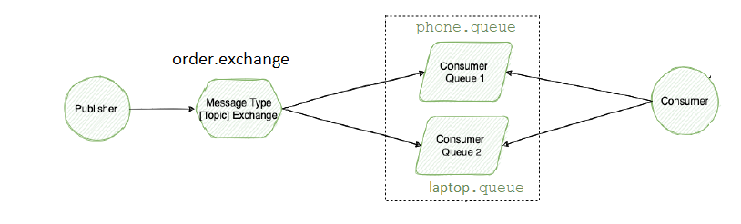
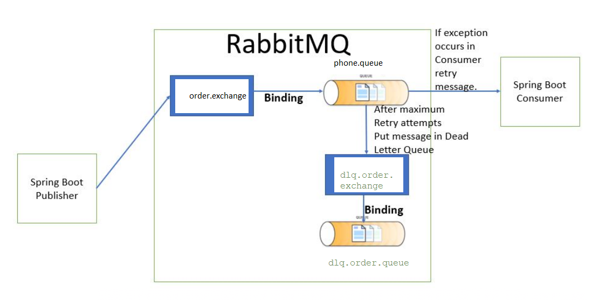
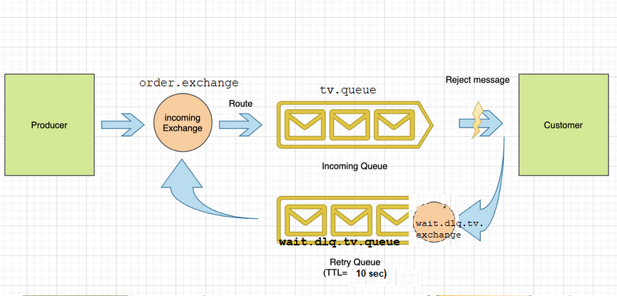

## Message oriented middleware(MOM): RabbitMQ project

### Start RabbitMq via Docker

To start run command:

`docker run -d --hostname my-rabbit --name some-rabbit -p 5672:5672 -p 15672:15672 rabbitmq:3-management`

Navigate to `http://localhost:15672/` to browse on UI.

Stop RabbitMQ: `docker stop some-rabbit`

Remove RabbitMQ container: `docker rm some-rabbit`

### Project Overview

Queues and other infrastructure are created from code during startup

Configs placed in application.properties

#### Task 1:

#### Task 2:

Design: retry mechanism + DLQ

For testing - uncomment lines in application.properties

#### Task 3:

Design: infinitive retry mechanism - by default. My functionality- retry once

Desc: Laptop Consumer pulls Msg from Queue. If processing fails- it tries to process again. If it fails at second attempt - discards msg

For testing - uncomment lines in application.properties and in ConsumerService

#### Task4: 

Design: TV Consumer pulls Msg from Queue and fails with processing. Msg goes to DLQ. DLQ configured with TTL(time to live) 10 sec and after it send msg back to main Order Exchange

For testing - uncomment lines in application.properties 

It`s also possible to reuse Incoming Exchanger(order.exchanger) to move to DLQ.

#### Task5 (Not implemented):

If queue is overflowed - move msg to DLQ

Ref: Default Max Queue Length Limit Behaviour. 
The default behaviour for RabbitMQ when a maximum queue length or size is set and the maximum is reached is to drop or dead-letter messages from the front of the queue (i.e. the oldest messages in the queue). T
